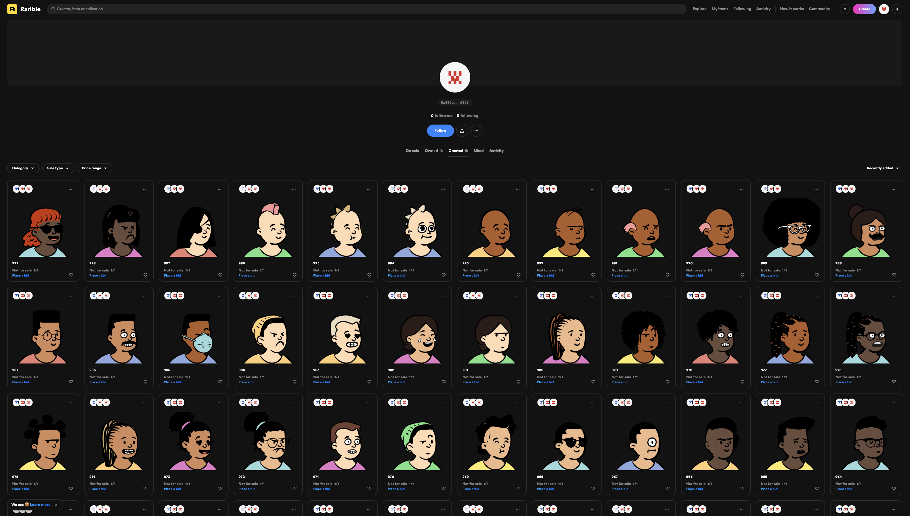

# Demiurge NFT
NFT from AI-generated works of Art

# Avatar Collection



# Quickstart

Just run the following to get started:

```
git clone https://github.com/JSWesterfield/demiurge-nft.git
cd demiurge-nft
npm install
node index
```

# Customize

You can also check out the [customizable.js](customizable.js) file to learn how you can tweak the derivation key path, which lets you generate every collection from a new address, derived from a single seed.


# Learn more

This project is powered by Rarepress, an NFT Operating System. Learn more about what you can do with Rarepress: https://rarepress.org

# Troubleshoot

- If you see some error, try updating your node.js to the latest version
- Also try using `npm ci` instead of `npm install` to install the dependencies
- If none of these work, try resetting the wallet by deleting the wallet file at `~/.mushie` by running `rm ~/.mushie` (WARNING: Please make sure to back up the wallet before you delete them). Once you reset, try running the app again, and it will let you generate a new seed (or import)